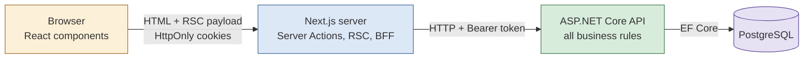
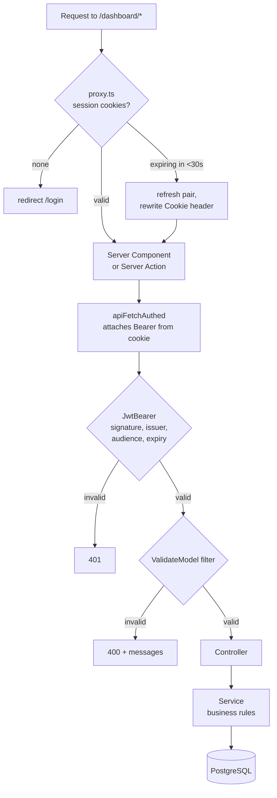
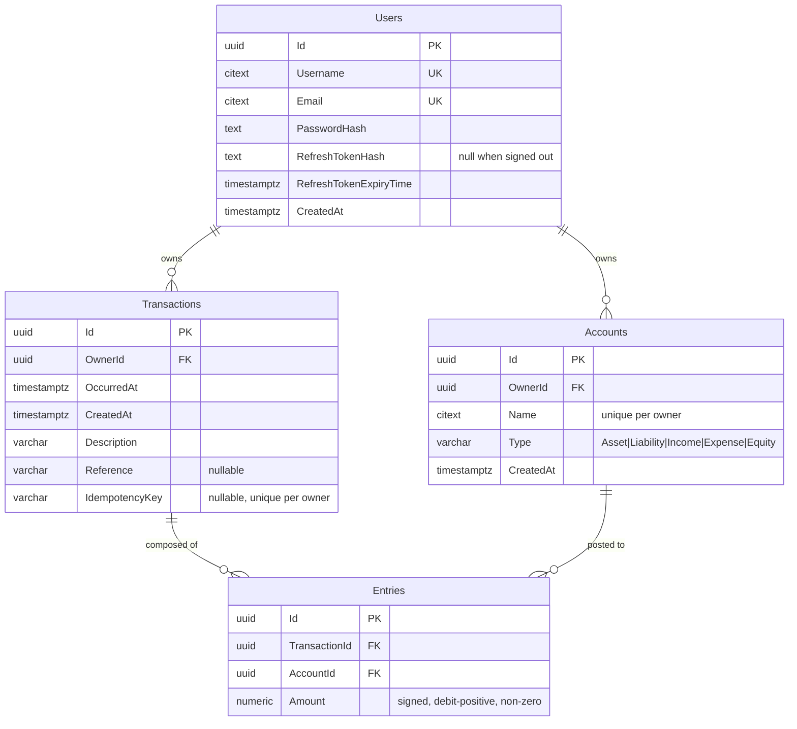
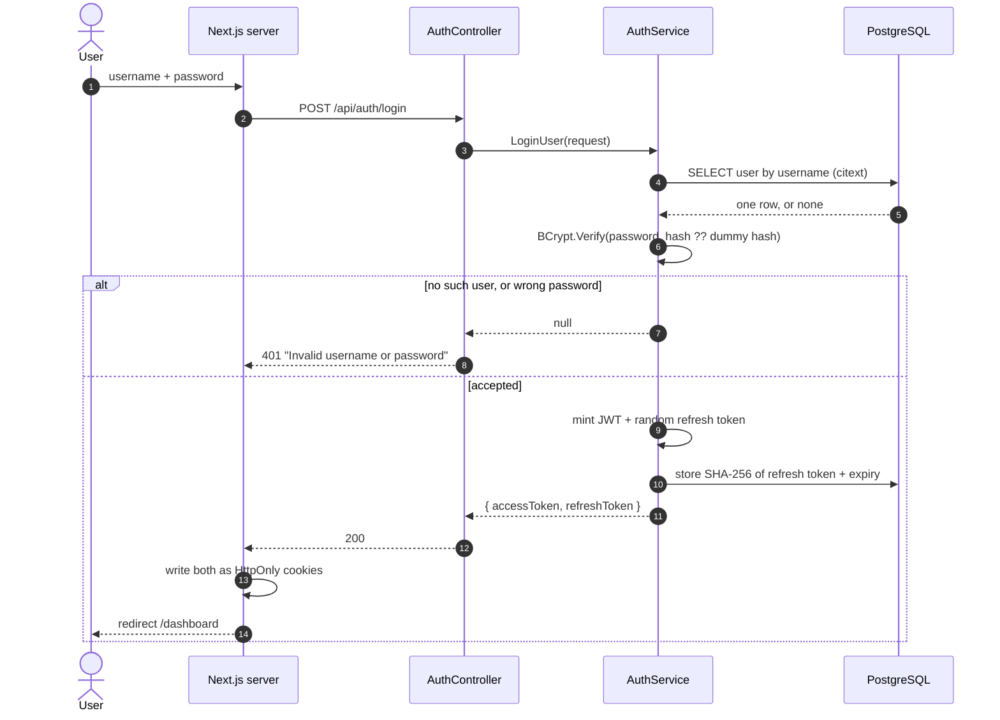
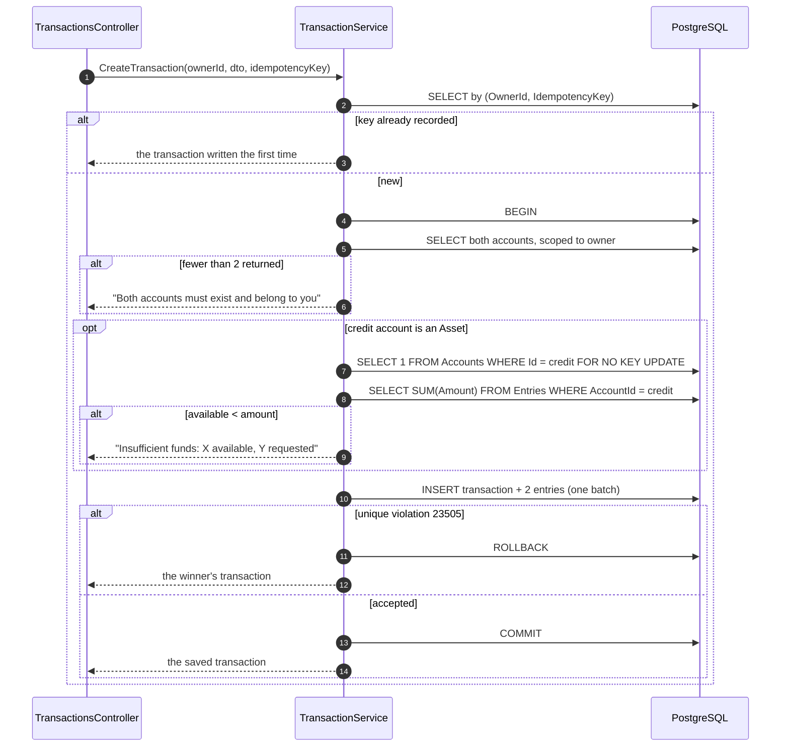

# Mini Transaction Ledger

A double-entry transaction ledger. You create accounts, record entries against
them, and the system works out every balance from those entries.

Every posting is recorded twice. Once as a destination and once as a source.
The two amounts always add up to zero. Balances are not stored anywhere. They
are summed from the entries on every read, so a balance cannot drift away from
the entries behind it. You cannot spend money out of an asset account that does
not hold it. And a posting cannot be recorded twice just because a reply got
lost on the way back.


---

## Table of contents

1. [Tech stack](#1-tech-stack)
2. [Setup and run](#2-setup-and-run)
   - [2.1 With Docker](#21-with-docker-recommended)
   - [2.2 Without Docker](#22-without-docker)
   - [2.3 Troubleshooting](#23-troubleshooting)
3. [API reference](#3-api-reference)
4. [Architecture](#4-architecture)
   - [4.1 Why two servers](#41-why-two-servers)
   - [4.2 Request flow](#42-request-flow)
   - [4.3 Data model](#43-data-model)
   - [4.4 Authentication](#44-authentication)
   - [4.5 Recording a transaction](#45-recording-a-transaction)
   - [4.6 Idempotency](#46-idempotency)
   - [4.7 Concurrency and locking](#47-concurrency-and-locking)
   - [4.8 Isolation level](#48-isolation-level)
5. [Inner workings](#5-inner-workings)
6. [Project layout](#6-project-layout)
7. [Known limitations](#7-known-limitations)

---

## 1. Tech stack

| Layer | Choice | Notes |
|---|---|---|
| **Frontend** | Next.js 16, React 19, TypeScript | App Router, React Server Components, Server Actions |
| **Styling** | Tailwind CSS v4, Base UI, lucide-react | dark and light themes via `next-themes` |
| **Backend** | ASP.NET Core 10 (.NET 10) | REST, controller based |
| **ORM** | Entity Framework Core 10 + Npgsql | LINQ translated to SQL. Raw SQL only for the row lock |
| **Database** | PostgreSQL 17 (14+ works) | `citext`, partial unique indexes, check constraints |
| **Migrations** | EF Core migrations | applied at startup, safe to run again |
| **Auth** | JWT (HMAC-SHA512) plus rotating refresh tokens | BCrypt for password hashing |
| **Mapping** | AutoMapper | `ProjectTo` so projections happen in SQL |
| **Containers** | Docker, Docker Compose | multi-stage builds, non-root, healthchecks |

---

## 2. Setup and run

Built and tested on macOS (Apple Silicon). Both paths below were run start to
finish before this file was written.

### 2.1 With Docker (recommended)

**You need:** Docker Desktop, running.

```bash
git clone https://github.com/abirzishan32/mini_ledger_system_misl.git
cd mini_ledger_system_misl
```

**Step 1. Create your `.env`.** Compose needs it. `.env` is gitignored, so the
repo ships `.env.example` as a template.

```bash
cp .env.example .env
```

**Step 2. Set a signing key.** The backend will not start without one.

```bash
printf '%s\n' "$(openssl rand -base64 48)"
```

Open `.env` and paste that value into `JWT_SIGNING_KEY=`. Replace
`POSTGRES_PASSWORD=change-me` with anything you like.

**Step 3. Start it.** `--wait` blocks until all three containers report healthy,
so when it returns the app is actually ready.

```bash
docker compose up --build -d --wait
```

The first run takes 2 to 4 minutes. That covers the image pulls and both
builds. After that it is a few seconds.

**Open http://localhost:3000** and create an account.

| URL | What |
|---|---|
| http://localhost:3000 | The application |
| http://localhost:5031/swagger | Swagger UI |
| http://localhost:5031/health | Liveness probe |

Other commands you will want:

```bash
docker compose logs -f backend     # follow the API log
docker compose ps                  # health of each service
docker compose down                # stop, keep the data
docker compose down -v             # stop and erase the database
```

### 2.2 Without Docker

**You need:** .NET SDK 10, Node.js 20.9+, PostgreSQL 13+.

```bash
brew install --cask dotnet-sdk
brew install node
brew install postgresql@17 && brew services start postgresql@17
```

`postgresql@17` is keg-only, so add it to your PATH for this shell:

```bash
export PATH="$(brew --prefix)/opt/postgresql@17/bin:$PATH"
```

**Step 1. Create the database.** Homebrew gives your macOS user a superuser role
with trust authentication, so you do not need a password locally.

```bash
createdb mini_ledger
```

**Step 2. Configure the backend.** Secrets go in .NET user-secrets, not in a
file in the repo.

```bash
cd backend
dotnet user-secrets set "ConnectionStrings:DefaultConnection" \
  "Host=localhost;Port=5432;Database=mini_ledger;Username=$(whoami)"
dotnet user-secrets set "AppSettings:Token" "$(openssl rand -base64 48)"
```

**Step 3. Run the backend.** Migrations run at startup, so there is no separate
`dotnet ef database update` step.

```bash
dotnet run --launch-profile http
```

It serves on http://localhost:5031. Leave it running.

**Step 4. Run the frontend** in a second terminal:

```bash
cd frontend
cp .env.example .env     # already points at http://localhost:5031
npm install
npm run dev
```

**Open http://localhost:3000.**

### 2.3 Troubleshooting

| Symptom | Cause and fix |
|---|---|
| `Missing configuration value 'AppSettings:Token'` | `JWT_SIGNING_KEY` is empty in `.env`, or user-secrets were never set. This is on purpose. The app will not start with no signing key |
| Port 3000 or 5031 already in use | Change `FRONTEND_PORT` or `BACKEND_PORT` in `.env`, or stop whatever is holding the port |
| `docker: command not found` on macOS | A drag-and-drop install of Docker Desktop can leave a stale `/usr/local/bin/docker` symlink. Use `/Applications/Docker.app/Contents/Resources/bin/docker`, or re-link it |
| Changed `POSTGRES_PASSWORD` and the backend cannot connect | Postgres only applies that when it first creates the data directory. Run `docker compose down -v` to recreate it |
| `createdb: command not found` | The keg-only PATH line above was not applied to this shell |

---

## 3. API reference

Every response uses the same envelope, `{ success, message, data, errors, statusCode, timeStamp }`,
for both success and failure. So a client only needs one code path for handling
responses.

| Method | Path | Auth | Purpose |
|---|---|---|---|
| `POST` | `/api/auth/register` | none | Create a login. Rate limited |
| `POST` | `/api/auth/login` | none | Trade credentials for an access and refresh token pair. Rate limited |
| `POST` | `/api/auth/refresh-token` | none | Trade a refresh token for a fresh pair |
| `POST` | `/api/auth/logout` | JWT | Erase the stored refresh token hash and end the session on the server |
| `GET` | `/api/auth/me` | JWT | Return the signed-in username from the token |
| `GET` | `/api/accounts` | JWT | List the caller's accounts with their balances |
| `POST` | `/api/accounts` | JWT | Create an account. `409` if the name is taken |
| `GET` | `/api/accounts/{id}` | JWT | One account with its balance |
| `PUT` | `/api/accounts/{id}` | JWT | Rename an account |
| `GET` | `/api/accounts/{id}/entries` | JWT | Statement. Entries oldest first, with a running balance |
| `GET` | `/api/accounts/trial-balance` | JWT | Every balance split into debit and credit columns, with totals |
| `GET` | `/api/transactions` | JWT | Paged history, newest first (`?page=`, `?pageSize=`) |
| `POST` | `/api/transactions` | JWT | Post one double-entry transaction. Accepts `Idempotency-Key` |
| `GET` | `/api/transactions/{id}` | JWT | One transaction with both entries |
| `GET` | `/health` | none | Liveness, used by the container healthcheck |

An account belonging to another user returns 404, not 403. Telling those two
apart would let someone use the endpoint to find out which ids exist.

---

## 4. Architecture

### 4.1 Why two servers



The browser never calls the API directly. Every request goes through the Next.js
server, which works as a Backend For Frontend. That buys three things.

- **Secrets stay on the server.** The API address and the access token are never
  in the browser bundle. `lib/api.ts` and `lib/ledger.ts` import `server-only`,
  so importing either from a client component is a build error.
- **The browser decides nothing.** Every form sets `noValidate`. The DTOs on the
  API own the rules. That way there is one definition of what is acceptable
  instead of two that can disagree.
- **One error shape.** A dead backend, a validation failure and an unhandled
  exception all arrive at the page in the same envelope.

Tokens sit in HttpOnly cookies, which page JavaScript cannot read. So an XSS bug
cannot steal a session.

### 4.2 Request flow



When a token is about to expire, the proxy renews it by rewriting the request's
Cookie header instead of redirecting. A redirect would turn a Server Action POST
into a GET and quietly throw away everything the user typed.

The proxy is a convenience layer, not the security boundary. It only runs on the
paths in its matcher. The real boundary is the JWT check on the API, and every
page reads the session again for itself.

### 4.3 Data model



`Entries.Amount` is one signed column, not two. Positive is a debit, negative is
a credit. Separate debit and credit columns would allow a row with values in
both, or in neither. Neither of those makes sense, and this shape cannot express
them. Checking the books also becomes one sum against zero instead of two sums
compared against each other.

These rules live in the database, not only in application code:

| Constraint | Why it is in the database |
|---|---|
| `UNIQUE (OwnerId, Name)` on Accounts | Two concurrent creates can both pass an application check |
| `UNIQUE (OwnerId, IdempotencyKey)` where the key is not null | This is what actually makes idempotency work. See 4.6 |
| `UNIQUE` on Username, Email | Same reasoning, for signups |
| `CHECK (Amount <> 0)` | A zero entry records nothing |
| `ON DELETE RESTRICT` on `Entries → Accounts` | Deleting an account that has been posted to would destroy history |
| `ON DELETE CASCADE` on `Entries → Transactions` | Entries mean nothing apart from their transaction |

### 4.4 Authentication

There are two tokens, because one cannot do both jobs.

| | Access token | Refresh token |
|---|---|---|
| Form | Signed JWT (HMAC-SHA512) | 32 random bytes |
| Lifetime | 15 minutes | 7 days |
| Checked by | Maths, no database lookup | Compared against a stored SHA-256 hash |
| Revocable | No | Yes |

A signed token is fast because nothing is looked up. That is also why it cannot
be cancelled. So it gets a short life. A 15 minute login would be miserable, so
a second token with a longer life exists only to get new ones. That one is
stored, so it can be revoked. Signing out erases the stored hash. That is what
makes it real. Deleting the browser cookie on its own would not stop a stolen
copy.



Two details in there are easy to miss.

**The dummy hash.** When the username does not exist, BCrypt still runs against
a hash nothing can match. Without it a wrong username answers in about 1 ms and
a wrong password in about 100 ms. That gap alone is enough to work out which
usernames are registered.

**Rotation.** Every refresh issues a new refresh token and overwrites the stored
hash. So a captured one stops working as soon as the real user renews.

### 4.5 Recording a transaction



The two entries are built inside the same object, in one statement:

```csharp
Entries =
{
    new Entry { AccountId = debitAccountId, Amount =  amount },
    new Entry { AccountId = creditAccountId, Amount = -amount }
}
```

There is no code path that creates one without the other. A half transaction is
not something the code guards against. It cannot be written in the first place.
All three inserts go out in a single `SaveChangesAsync` inside one database
transaction, so a crash partway through leaves nothing behind.

### 4.6 Idempotency

A client that sends a request and hears nothing back cannot tell whether it
never arrived, or arrived and the reply was lost. One guess loses the
transaction. The other records it twice.

So the client attaches a random `Idempotency-Key` header that identifies this
attempt. It is created when the form opens and replaced only after a posting
succeeds. A retry carries the same key. A genuinely new posting gets a fresh
one. Keying on the contents would be wrong, because buying coffee twice in one
day produces two postings that look identical and both are real.

The server does two things with that key, and they are not equally important.

1. A lookup before writing. Cheap, and it handles the ordinary retry.
2. A partial unique index on `(OwnerId, IdempotencyKey)`. This is the part that
   actually guarantees anything.

The lookup is check-then-act. Two requests can both find nothing and both carry
on. The index is evaluated by PostgreSQL inside the commit, where nothing can
slip in between. The loser catches SQLSTATE `23505`, rolls back, and reads the
winner's row instead. Both callers get the same transaction back and one row
exists.

Firing two requests with the same key from two threads, eight
times over, seven of the eight got past the lookup and were settled by the
index. An application check and a database constraint look similar. They are not
the same guarantee.

### 4.7 Concurrency and locking

Balances are derived, so inserting transactions at the same time is safe on its
own. The overdraft rule is what creates a race, because it has to read before it
writes:

| Time | Request A | Request B | Cash |
|---|---|---|---|
| 1 | reads 100 | | 100 |
| 2 | | reads 100 | 100 |
| 3 | 100 ≥ 60, allow | 100 ≥ 60, allow | 100 |
| 4 | insert −60 | insert −60 | **−20** |

Both checks were correct when they ran. This is write skew, and isolation on its
own does not stop it. The fix is to make the two queue up by locking the account
row before reading its balance:

```sql
SELECT 1 FROM "Accounts" WHERE "Id" = {creditAccountId} FOR NO KEY UPDATE
```

**Why `FOR NO KEY UPDATE` and not `FOR UPDATE`.** The first version used
`FOR UPDATE` and deadlocked under test. 40 simultaneous A→B and B→A transfers
produced three `40P01` errors. The cause is not visible in the code. Inserting
an `Entry` takes an implicit `FOR KEY SHARE` lock on the account its foreign key
points at, so every posting really touches both account rows. `FOR UPDATE`
conflicts with `FOR KEY SHARE`. So A→B held one row and waited on the other,
while B→A did the same thing in reverse.

| Lock | Conflicts with itself? | Conflicts with `FOR KEY SHARE`? |
|---|---|---|
| `FOR UPDATE` | yes | yes, and that was the bug |
| `FOR NO KEY UPDATE` | yes, so withdrawals still queue | no, so entry inserts go through |

Both of those properties are needed, and the weaker lock has both. No cycle can
form. One row is locked explicitly, in a mode that does not conflict with the
foreign key lock the other posting needs. After the change the same test did 205
lock acquisitions with zero deadlocks.

The lock sits inside the transaction because a lock lives exactly as long as its
transaction. Taken outside, it would be released before the insert it is meant
to protect.

### 4.8 Isolation level

The system runs on PostgreSQL's default, Read Committed. That was a decision,
not something left unconsidered.

Read Committed guarantees you never read another transaction's uncommitted work.
It does not prevent write skew. In the table above both reads were of committed
data, and both were correct at the time.

Why not the alternatives:

| Option | Why not |
|---|---|
| **Serializable** | It would prevent write skew, but it does that by aborting one transaction with a serialization error that the application has to catch and retry. That retry logic would apply to every write, for a problem that only affects one check |
| **Repeatable Read** | Also aborts to catch anomalies, so it carries the same retry burden, and in PostgreSQL it still allows write skew |
| **Optimistic concurrency** | It detects conflicting modifications. Nothing is modified here. Both requests only insert, so there is no version to compare |
| **A stored balance column** | It would make the check one atomic statement, but it brings back two facts that can disagree |
| **A `CHECK` constraint** | A constraint can look at a row. It cannot look at a `SUM` over many rows in another table |

Locking one row is the smallest thing that closes the gap. It also costs nothing
for postings that do not touch an asset account, because those take no lock at
all.

---

## 5. Inner workings

**Balances are never stored.** Every balance is `SUM(Amount)` over that
account's entries, written as a correlated subquery so a full listing is one
statement rather than one per account:

```csharp
Balance = _appDbContext.Entries
    .Where(entry => entry.AccountId == account.Id)
    .Sum(entry => (decimal?)entry.Amount) ?? 0m
```

The `decimal?` cast matters. SQL `SUM` over zero rows returns `NULL`, so without
it a new account fails to load instead of reading `0.00`.

**Ownership never comes from the request.** The user id comes from the verified
token, through `User.GetUserId()`. No DTO has an owner field. `apiFetchAuthed`
takes no user id parameter either. So there is no way to ask for another user's
data.

**The trial balance is the ledger checking itself.** Every transaction writes
amounts that add up to zero, so splitting all the balances into two columns by
sign always gives two equal totals. A mismatch would not mean someone made a
bookkeeping mistake. It would mean an entry exists without its other half. It
proves the books are consistent, not that they are correct. The right amount in
the wrong account still balances.

**Only asset accounts have a floor.** Crediting Cash means money leaving. You
cannot pay out what you do not hold, and recording it would make the ledger
state something untrue. A liability going further negative just means you owe
more, which is always possible. This is a policy choice in this system, not a
rule of accounting. A real overdraft account can go negative and this ledger
would refuse it.

**Validation lives in one place.** DTO attributes, plus `IValidatableObject` for
the cross-field rules. A single global `ValidateModelAttribute` reports them, so
no controller repeats the check and none of them can forget it.

---

## 6. Project layout

```
.
├── backend/                 ASP.NET Core API
│   ├── Controllers/         HTTP surface + ApiResponse envelope
│   ├── Services/            business rules (Auth, Account, Transaction)
│   ├── Data/                AppDbContext, schema, indexes, constraints
│   ├── Entities/ DTOs/      persistence and wire models
│   ├── Filters/             global model-state validation
│   ├── Migrations/          EF Core migrations
│   └── Dockerfile
├── frontend/                Next.js application
│   ├── app/                 routes, Server Components, Server Actions
│   ├── lib/                 server-only API client, auth, formatting
│   ├── components/          shared and UI primitives
│   ├── proxy.ts             session routing and token renewal
│   └── Dockerfile
├── docker-compose.yml       db + backend + frontend
└── .env.example             template for the compose secrets
```

---

## 7. Known limitations

- **Deadlocks are not retried.** Testing did not produce any after the lock
  change, but if PostgreSQL reported `40P01` the error would reach the user
  instead of being retried with a backoff.
- **No request fingerprint on the idempotency key.** Send the same key with a
  different body and you get the original transaction back, and the new content
  is ignored. Storing a hash of the request next to the key would close that.
- **Statements load the whole history.** A running balance depends on every
  earlier row, so paging it needs the opening balance fetched as a separate
  `SUM`. Fine at this size. Not fine at ten million entries.
- **No automated test suite.** Behaviour was checked with purpose-built
  concurrency harnesses, including thread barriers and a response-dropping TCP
  proxy, rather than a committed test project.
