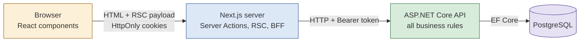
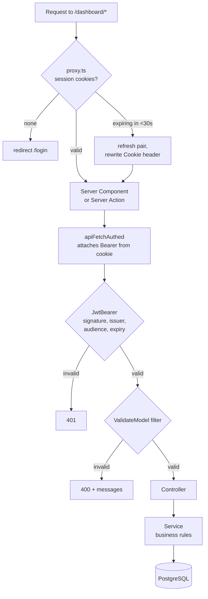
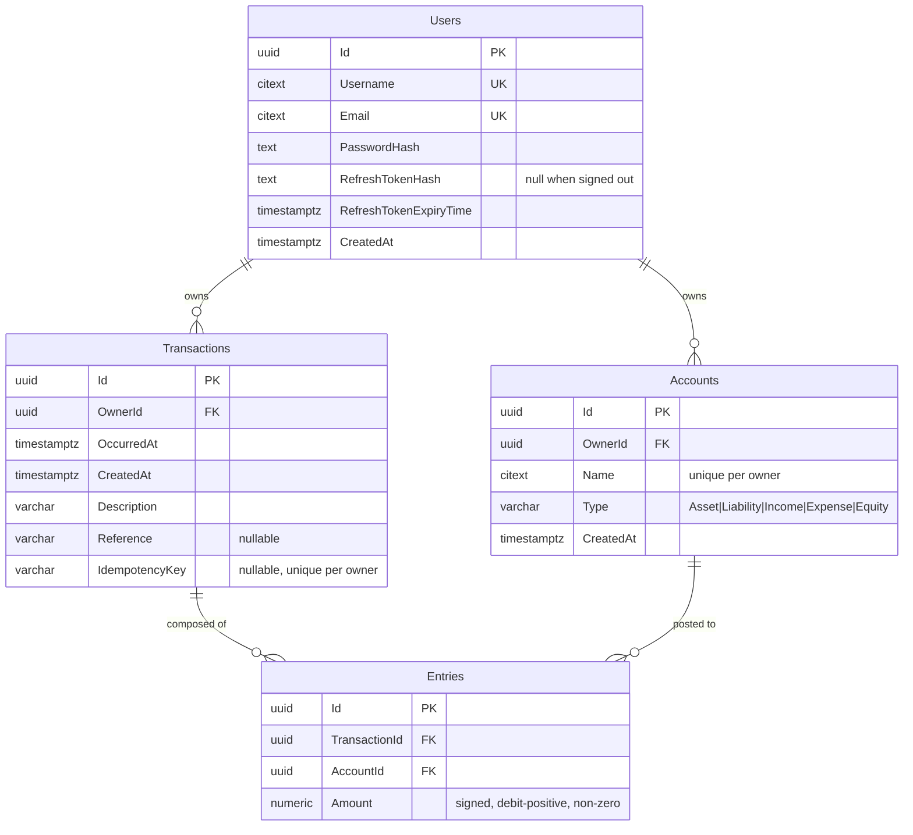
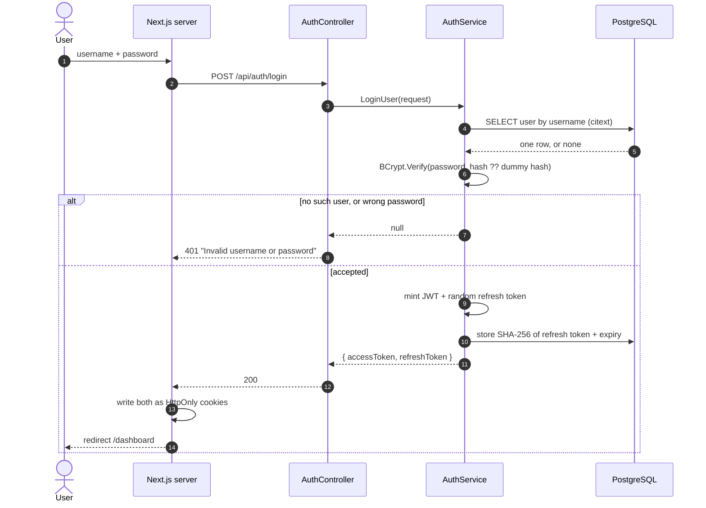
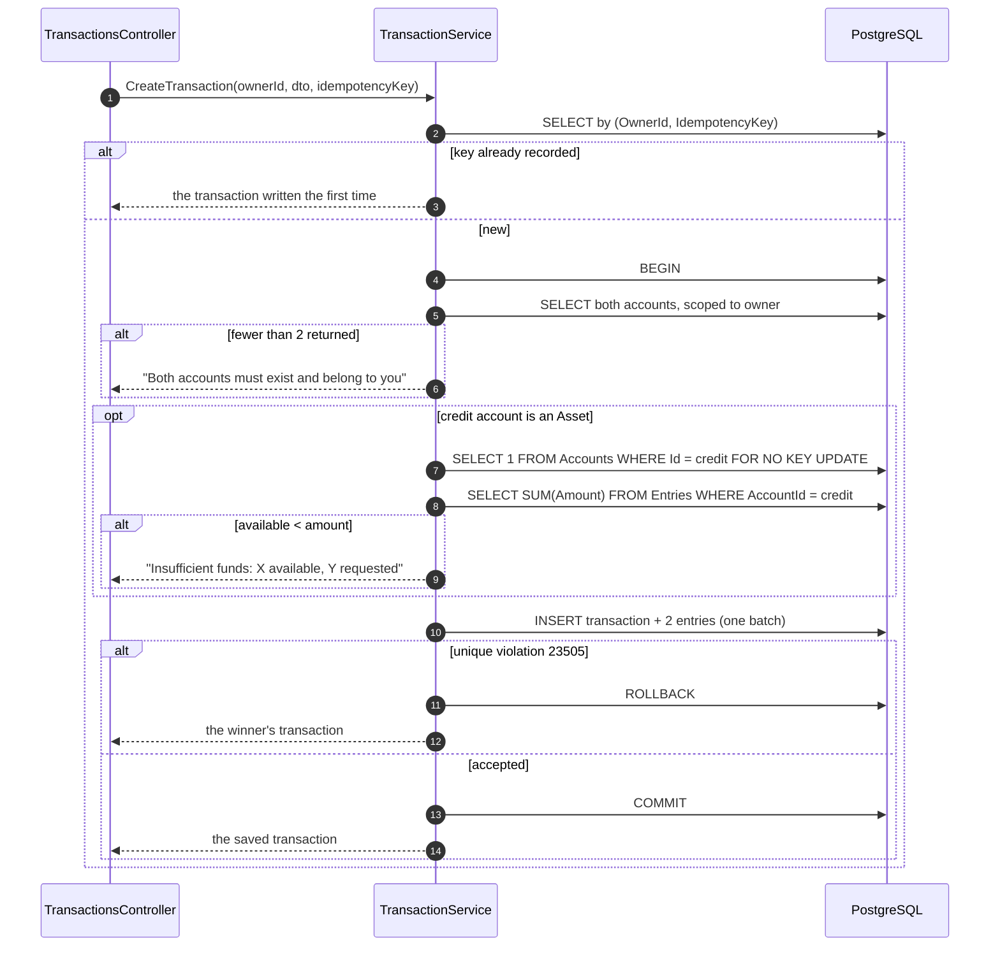

# Mini Ledger

A double-entry transaction ledger. You create accounts, record entries against
them, and the system derives every balance and proves the books add up.

Every posting is recorded twice — once as a destination, once as a source — and
the two amounts always sum to zero. Balances are never stored; they are summed
from the entries on every read, so a balance cannot drift from the entries that
produced it. Money cannot be spent out of an asset account it does not hold, and
a posting cannot be recorded twice because a reply was lost.

Built for the Millennium Information Solution Ltd Fresher Assessment
(Problem 1 — Mini Transaction Ledger).

---

## Table of contents

1. [Tech stack](#1-tech-stack)
2. [Setup and run](#2-setup-and-run)
   - [2.1 With Docker](#21-with-docker-recommended)
   - [2.2 Without Docker](#22-without-docker)
   - [2.3 Troubleshooting](#23-troubleshooting)
3. [API reference](#3-api-reference)
4. [Architecture](#4-architecture)
   - [4.1 Why two servers](#41-why-two-servers)
   - [4.2 Request flow](#42-request-flow)
   - [4.3 Data model](#43-data-model)
   - [4.4 Authentication](#44-authentication)
   - [4.5 Recording a transaction](#45-recording-a-transaction)
   - [4.6 Idempotency](#46-idempotency)
   - [4.7 Concurrency and locking](#47-concurrency-and-locking)
   - [4.8 Isolation level](#48-isolation-level)
5. [Inner workings](#5-inner-workings)
6. [Project layout](#6-project-layout)
7. [Known limitations](#7-known-limitations)

---

## 1. Tech stack

| Layer | Choice | Notes |
|---|---|---|
| **Frontend** | Next.js 16, React 19, TypeScript | App Router, React Server Components, Server Actions |
| **Styling** | Tailwind CSS v4, Base UI, lucide-react | dark/light via `next-themes` |
| **Backend** | ASP.NET Core 10 (.NET 10) | REST, controller-based |
| **ORM** | Entity Framework Core 10 + Npgsql | LINQ translated to SQL; raw SQL only for the row lock |
| **Database** | PostgreSQL 17 (14+ works) | `citext`, partial unique indexes, check constraints |
| **Migrations** | EF Core migrations | applied automatically at startup, idempotent |
| **Auth** | JWT (HMAC-SHA512) + rotating refresh tokens | BCrypt password hashing |
| **Mapping** | AutoMapper | `ProjectTo` for SQL-side projections |
| **Containers** | Docker, Docker Compose | multi-stage builds, non-root, healthchecks |

---

## 2. Setup and run

Built and tested on **macOS (Apple Silicon)**. Both paths below were run
end to end before this file was written.

### 2.1 With Docker (recommended)

**Requires:** Docker Desktop, running.

```bash
git clone https://github.com/abirzishan32/mini_ledger_system_misl.git
cd mini_ledger_system_misl
```

**Step 1 — create your `.env`.** Compose needs it; `.env` is gitignored, so the
repo ships `.env.example` as the template.

```bash
cp .env.example .env
```

**Step 2 — set a signing key.** The backend refuses to start without one.

```bash
printf '%s\n' "$(openssl rand -base64 48)"
```

Open `.env` and paste that value into `JWT_SIGNING_KEY=`. Replace
`POSTGRES_PASSWORD=change-me` with anything you like.

**Step 3 — start.** `--wait` blocks until all three containers report healthy,
so when it returns the app is genuinely ready.

```bash
docker compose up --build -d --wait
```

First run takes 2–4 minutes (image pulls plus both builds). After that, seconds.

**Open http://localhost:3000** and create an account.

| URL | What |
|---|---|
| http://localhost:3000 | The application |
| http://localhost:5031/swagger | Swagger UI |
| http://localhost:5031/health | Liveness probe |

Useful commands:

```bash
docker compose logs -f backend     # follow the API log
docker compose ps                  # health of each service
docker compose down                # stop, keep the data
docker compose down -v             # stop and erase the database
```

### 2.2 Without Docker

**Requires:** .NET SDK 10, Node.js 20.9+, PostgreSQL 13+.

```bash
brew install --cask dotnet-sdk
brew install node
brew install postgresql@17 && brew services start postgresql@17
```

`postgresql@17` is keg-only, so add it to your PATH for this shell:

```bash
export PATH="$(brew --prefix)/opt/postgresql@17/bin:$PATH"
```

**Step 1 — create the database.** Homebrew gives your macOS user a superuser
role with trust authentication, so no password is needed locally.

```bash
createdb mini_ledger
```

**Step 2 — configure the backend.** Secrets go in .NET user-secrets, never in a
file in the repo.

```bash
cd backend
dotnet user-secrets set "ConnectionStrings:DefaultConnection" \
  "Host=localhost;Port=5432;Database=mini_ledger;Username=$(whoami)"
dotnet user-secrets set "AppSettings:Token" "$(openssl rand -base64 48)"
```

**Step 3 — run the backend.** Migrations are applied on startup, so there is no
separate `dotnet ef database update` step.

```bash
dotnet run --launch-profile http
```

It serves on **http://localhost:5031**. Leave it running.

**Step 4 — run the frontend** in a second terminal:

```bash
cd frontend
cp .env.example .env     # already points at http://localhost:5031
npm install
npm run dev
```

**Open http://localhost:3000.**

### 2.3 Troubleshooting

| Symptom | Cause and fix |
|---|---|
| `Missing configuration value 'AppSettings:Token'` | `JWT_SIGNING_KEY` is empty in `.env`, or user-secrets were not set. This is deliberate — the app will not start with no signing key |
| Port 3000 or 5031 already in use | Change `FRONTEND_PORT` / `BACKEND_PORT` in `.env`, or stop the other process |
| `docker: command not found` on macOS | Docker Desktop installed by drag-and-drop can leave a stale `/usr/local/bin/docker` symlink. Use `/Applications/Docker.app/Contents/Resources/bin/docker`, or re-link it |
| Changed `POSTGRES_PASSWORD` and the backend cannot connect | Postgres only applies it when the data directory is created. Run `docker compose down -v` to recreate it |
| `createdb: command not found` | The keg-only PATH line above was not applied to this shell |

---

## 3. API reference

Every response is the same envelope — `{ success, message, data, errors, statusCode, timeStamp }` —
for both success and failure, so a client needs one handling path.

| Method | Path | Auth | Purpose |
|---|---|---|---|
| `POST` | `/api/auth/register` | — | Create a login. Rate limited |
| `POST` | `/api/auth/login` | — | Exchange credentials for an access + refresh token pair. Rate limited |
| `POST` | `/api/auth/refresh-token` | — | Exchange a refresh token for a fresh pair |
| `POST` | `/api/auth/logout` | JWT | Erase the stored refresh token hash, ending the session server-side |
| `GET` | `/api/auth/me` | JWT | Return the signed-in username from the token |
| `GET` | `/api/accounts` | JWT | List the caller's accounts with derived balances |
| `POST` | `/api/accounts` | JWT | Create an account. `409` if the name is taken |
| `GET` | `/api/accounts/{id}` | JWT | One account with its balance |
| `PUT` | `/api/accounts/{id}` | JWT | Rename an account |
| `GET` | `/api/accounts/{id}/entries` | JWT | Statement: entries oldest first, with a running balance |
| `GET` | `/api/accounts/trial-balance` | JWT | Every balance split into debit/credit columns, with totals |
| `GET` | `/api/transactions` | JWT | Paged history, newest first (`?page=`, `?pageSize=`) |
| `POST` | `/api/transactions` | JWT | Post one double-entry transaction. Accepts `Idempotency-Key` |
| `GET` | `/api/transactions/{id}` | JWT | One transaction with both entries |
| `GET` | `/health` | — | Liveness, used by the container healthcheck |

An account belonging to another user returns **404, not 403** — telling the two
apart would turn the endpoint into a way to discover which ids exist.

---

## 4. Architecture

### 4.1 Why two servers



The browser never calls the API directly. Every request goes through the
Next.js server, which acts as a **Backend For Frontend**. Three consequences:

- **Secrets stay server-side.** The API's address and the access token are never
  in the browser bundle. `lib/api.ts` and `lib/ledger.ts` import `server-only`,
  so importing them from a client component is a build error.
- **The browser decides nothing.** Every form carries `noValidate`: the DTOs on
  the API own every rule, so there is one definition of what is acceptable
  rather than two that can disagree.
- **One error shape.** A dead backend, a validation failure and an unhandled
  exception all reach the page as the same envelope.

Tokens live in **HttpOnly cookies**, which page JavaScript cannot read. An XSS
bug therefore cannot steal a session.

### 4.2 Request flow



The proxy renews an expiring token by **rewriting the request's Cookie header**
rather than redirecting. A redirect would turn a Server Action POST into a GET
and silently discard everything the user typed.

The proxy is a convenience layer, **not** the security boundary — it only runs on
paths in its matcher. The real boundary is the JWT check on the API, and every
page re-reads the session itself.

### 4.3 Data model



**One signed column, not two.** `Entries.Amount` is positive for a debit and
negative for a credit. Separate debit and credit columns would permit a row with
values in both, or neither — nonsense states that this shape cannot express.
Checking the books then becomes one sum against zero instead of two sums
compared.

Rules enforced by the database, not only by application code:

| Constraint | Why it is in the database |
|---|---|
| `UNIQUE (OwnerId, Name)` on Accounts | Two concurrent creates can both pass an application check |
| `UNIQUE (OwnerId, IdempotencyKey)` where key is not null | The guarantee behind idempotency — see 4.6 |
| `UNIQUE` on Username, Email | Same reasoning, for signups |
| `CHECK (Amount <> 0)` | A zero entry records nothing |
| `ON DELETE RESTRICT` on `Entries → Accounts` | Deleting a posted-to account would destroy history |
| `ON DELETE CASCADE` on `Entries → Transactions` | Entries have no meaning apart from their transaction |

### 4.4 Authentication

Two tokens, because one cannot do both jobs.

| | Access token | Refresh token |
|---|---|---|
| Form | Signed JWT (HMAC-SHA512) | 32 random bytes |
| Lifetime | 15 minutes | 7 days |
| Checked by | Mathematics — no database lookup | Comparison against a stored SHA-256 hash |
| Revocable | **No** | **Yes** |

A signed token is fast precisely because nothing is looked up — which is also why
it cannot be cancelled. So it is given a short life. That would force constant
re-login, so a second, longer-lived token exists only to obtain new ones; it *is*
stored, so it *can* be revoked. **Signing out erases the stored hash**, which is
what makes it real: deleting the browser's cookie alone would not stop a stolen
copy.



Two details worth noting:

- **The dummy hash.** When the username does not exist, BCrypt still runs against
  an unmatchable hash. Without it a wrong username would answer in ~1 ms and a
  wrong password in ~100 ms, and that gap alone would let an attacker enumerate
  which usernames are registered.
- **Rotation.** Every refresh issues a *new* refresh token and overwrites the
  stored hash, so a captured one stops working the moment the real user renews.

### 4.5 Recording a transaction



The two entries are constructed **inside the same object**, in one statement:

```csharp
Entries =
{
    new Entry { AccountId = debitAccountId, Amount =  amount },
    new Entry { AccountId = creditAccountId, Amount = -amount }
}
```

There is no code path that can create one without the other. A half-transaction
is not a bug that is guarded against — it cannot be expressed. All three inserts
go in a single `SaveChangesAsync` inside one database transaction, so a crash
mid-write leaves nothing behind.

### 4.6 Idempotency

A client that sends a request and hears nothing cannot tell whether it never
arrived, or arrived and the reply was lost. One guess loses the transaction; the
other records it twice.

The client attaches a random **`Idempotency-Key`** header identifying *this
attempt*. It is minted when the form opens and replaced **only after a posting
succeeds** — so a retry carries the same key, while a genuinely new posting gets
a fresh one. Keying on the contents instead would be wrong: buying coffee twice
in one day produces two identical-looking postings, and both are real.

The server does two things with it, and they are not equally important:

1. **A lookup before writing.** Cheap, and settles the ordinary retry.
2. **A partial unique index on `(OwnerId, IdempotencyKey)`.** *This* is the
   guarantee.

The lookup is check-then-act: two requests can both find nothing and both
proceed. The index is evaluated by PostgreSQL inside the commit, where nothing
can slip between. The loser catches SQLSTATE `23505`, rolls back, and re-reads
the winner's row — both callers receive the same transaction, and one row exists.

> Measured on this system: firing two requests with the same key from two threads
> eight times, **seven of eight** got past the lookup and were settled by the
> index. An application check and a database constraint look alike and are not
> remotely the same guarantee.

### 4.7 Concurrency and locking

Balances are derived, so inserting transactions concurrently is safe by itself.
The overdraft rule is what introduces a race, because it must **read before
writing**:

| Time | Request A | Request B | Cash |
|---|---|---|---|
| 1 | reads 100 | | 100 |
| 2 | | reads 100 | 100 |
| 3 | 100 ≥ 60, allow | 100 ≥ 60, allow | 100 |
| 4 | insert −60 | insert −60 | **−20** |

Both checks were correct when they ran. This is **write skew**, and isolation
alone does not prevent it. The fix is to serialise the two by locking the
account row before reading its balance:

```sql
SELECT 1 FROM "Accounts" WHERE "Id" = {creditAccountId} FOR NO KEY UPDATE
```

**Why `FOR NO KEY UPDATE` and not `FOR UPDATE`.** The first version used
`FOR UPDATE` and deadlocked under test — 40 simultaneous A→B and B→A transfers
produced three `40P01` errors. The cause is not visible in the code: inserting an
`Entry` takes an *implicit* `FOR KEY SHARE` lock on the account its foreign key
points at, so every posting really touches **both** account rows.
`FOR UPDATE` conflicts with `FOR KEY SHARE`, so A→B held one row and waited for
the other, while B→A did the mirror image.

| Lock | Conflicts with itself? | Conflicts with `FOR KEY SHARE`? |
|---|---|---|
| `FOR UPDATE` | yes | **yes** — this was the bug |
| `FOR NO KEY UPDATE` | **yes** — withdrawals still queue | **no** — entry inserts pass |

Both properties are needed, and the weaker lock has exactly both. **No cycle can
form:** one row is locked explicitly, in a mode that does not conflict with the
foreign-key lock the other posting needs. After the change: 205 lock
acquisitions, zero deadlocks.

The lock lives **inside** the transaction because a lock's lifetime *is* the
transaction's lifetime — taken outside, it would be released before the insert it
protects.

### 4.8 Isolation level

The system runs on PostgreSQL's default, **Read Committed**. That is a decision,
not an oversight.

Read Committed guarantees you never read another transaction's uncommitted work.
It does **not** prevent write skew — in the table above, both reads were of
committed data and both were correct at the time.

Why not the alternatives:

| Option | Why not |
|---|---|
| **Serializable** | It *would* prevent write skew, but by aborting one transaction with a serialization error that the application must catch and retry. That retry logic would apply to every write, for a problem confined to one check |
| **Repeatable Read** | Also detects some anomalies by aborting, with the same retry burden, and still permits write skew in PostgreSQL |
| **Optimistic concurrency** | Detects conflicting *modifications*. Nothing is modified here — both requests only insert — so there is no version to compare |
| **A stored balance column** | Would make the check a single atomic statement, but reintroduces two facts that can disagree |
| **A `CHECK` constraint** | A constraint can inspect a row, not a `SUM` over many rows in another table |

Locking one row is the smallest mechanism that actually closes the gap, and it
costs nothing for postings that do not touch an asset account — they take no lock
at all.

---

## 5. Inner workings

**Balances are never stored.** Every balance is `SUM(Amount)` over that account's
entries, expressed as a correlated subquery so a full listing costs one
statement, not one per account:

```csharp
Balance = _appDbContext.Entries
    .Where(entry => entry.AccountId == account.Id)
    .Sum(entry => (decimal?)entry.Amount) ?? 0m
```

The `decimal?` cast is load-bearing: SQL `SUM` over zero rows is `NULL`, so a new
account would otherwise fail to materialise instead of reading `0.00`.

**Ownership is never taken from the request.** The user id comes from the
verified token via `User.GetUserId()`. There is no owner field in any DTO, and
`apiFetchAuthed` takes no user-id parameter — so asking for another user's data
is not merely blocked, it cannot be expressed.

**The trial balance is the ledger checking itself.** Every transaction writes
amounts summing to zero, so splitting all balances into two columns by sign
always produces two equal totals. A mismatch would not mean a bookkeeping mistake —
it would mean an entry exists without its other half. It proves consistency, not
correctness: the right amount in the wrong account still balances.

**Only asset accounts have a floor.** Crediting Cash means money leaving; you
cannot pay out what you do not hold, and recording it would make the ledger state
something untrue. A liability going further negative just means you owe more,
which is always possible. This is a *policy* of this system, not a law of
accounting — a real overdraft account can go negative, and this ledger would
wrongly refuse it.

**Validation lives in one place.** DTO attributes plus `IValidatableObject` for
cross-field rules, surfaced by a single global `ValidateModelAttribute` so no
controller repeats the check and none can forget it.

---

## 6. Project layout

```
.
├── backend/                 ASP.NET Core API
│   ├── Controllers/         HTTP surface + ApiResponse envelope
│   ├── Services/            business rules (Auth, Account, Transaction)
│   ├── Data/                AppDbContext — schema, indexes, constraints
│   ├── Entities/ DTOs/      persistence and wire models
│   ├── Filters/             global model-state validation
│   ├── Migrations/          EF Core migrations
│   └── Dockerfile
├── frontend/                Next.js application
│   ├── app/                 routes, Server Components, Server Actions
│   ├── lib/                 server-only API client, auth, formatting
│   ├── components/          shared and UI primitives
│   ├── proxy.ts             session routing and token renewal
│   └── Dockerfile
├── docker-compose.yml       db + backend + frontend
└── .env.example             template for the compose secrets
```

---

## 7. Known limitations

Stated plainly rather than discovered by a reviewer:

- **Deadlocks are not retried.** Avoided in testing, but if PostgreSQL reported
  `40P01` the error would reach the user instead of being retried with a backoff.
- **No request fingerprint on the idempotency key.** The same key sent with a
  *different* body returns the original transaction and silently ignores the new
  content. Storing a hash of the request beside the key would close it.
- **Statements load the whole history.** A running balance depends on every
  earlier row, so paging it needs the opening balance as a separate `SUM`. Fine
  at this size; not at ten million entries.
- **No automated test suite.** Behaviour was verified with purpose-built
  concurrency harnesses (thread barriers, a response-dropping TCP proxy) rather
  than a committed test project.
